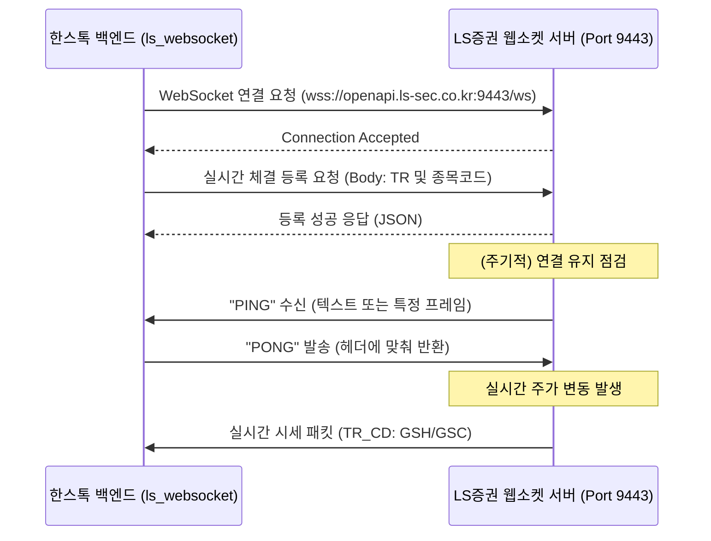

# LS증권 OpenAPI 자동매매 유튜브 강의 정밀 분석 및 시스템 설계 보고서

본 문서는 **'주식 코딩(Stock Coding)'** 유튜브 채널 및 관련 커뮤니티에서 다루는 **LS증권(구 이베스트투자증권) OPEN API** 자동매매 시스템 구축 내용을 정밀 분석하고, 이를 **한스톡(Hanstock)** 프로젝트 아키텍처에 통합하기 위해 작성된 기술 설계 및 연계 보고서입니다.

LS증권 OpenAPI의 주요 기능별 TR(Transaction) 코드, OAuth2 토큰 인증 방식, 실시간 웹소켓(WebSocket) 처리 로직을 정리하고, 기존 [kis_api.py](file:///C:/MSF-LOC/workstudy/hanstock/src/api/kis_api.py) 및 [kis_websocket.py](file:///C:/MSF-LOC/workstudy/hanstock/src/api/kis_websocket.py)를 벤치마킹하여 새로 추가할 LS증권 연동 모듈 설계안을 제시합니다.

---

## 📌 1. 전체 강의 요약 및 기술 분류 (LS증권 중심)

유튜브 채널 및 공식 OpenAPI 명세서에 따른 국내 및 해외주식 자동매매 핵심 기술 분류표입니다.

| 분류 | 주요 주제 | 핵심 기술 요소 | 한스톡 연관 모듈 (KIS 대응) | 신규 추가 예정 파일 |
| :--- | :--- | :--- | :--- | :--- |
| **A. 인증 & 접속** | OAuth2 토큰 발급 및 관리 | AppKey/AppSecret 인증, `POST /oauth2/token`, Access Token 자동 갱신 및 캐싱 | [kis_api.py](file:///C:/MSF-LOC/workstudy/hanstock/src/api/kis_api.py) | [ls_api.py](file:///C:/MSF-LOC/workstudy/hanstock/src/api/ls_api.py) |
| **B. 국내 주식 REST** | 국내 주식 거래 TR 연동 | 현재가 조회 (`t1102`), 기간별 차트 (`t8413`), 예수금 조회 (`CSPAQ22200`), 주식 주문 (`CSPAT00600`) | [kis_api.py](file:///C:/MSF-LOC/workstudy/hanstock/src/api/kis_api.py) | [ls_api.py](file:///C:/MSF-LOC/workstudy/hanstock/src/api/ls_api.py) |
| **C. 해외 주식 REST** | 미국 주식 거래 TR 연동 | 미국 주식 시세 (`g3101`), 미국 주식 지정가 주문 (`COSAT00301`), 계좌 잔고 조회 (`COSOQ00201`) | [kis_api.py](file:///C:/MSF-LOC/workstudy/hanstock/src/api/kis_api.py) | [ls_api.py](file:///C:/MSF-LOC/workstudy/hanstock/src/api/ls_api.py) |
| **D. 웹소켓 실시간** | WebSocket을 통한 시세/체결 수신 | 실시간 호가/체결 데이터 구독 및 파싱 (`GSH`/`GSC`), 실시간 계좌 체결 통보 수신 | [kis_websocket.py](file:///C:/MSF-LOC/workstudy/hanstock/src/api/kis_websocket.py) | [ls_websocket.py](file:///C:/MSF-LOC/workstudy/hanstock/src/api/ls_websocket.py) |
| **E. 시스템 설계** | API 트래픽 제어 및 예외 처리 | API 호출 스로틀링(초당 호출 횟수 제한), 네트워크 순단 시 재연결 루프 | [trader.py](file:///C:/MSF-LOC/workstudy/hanstock/src/trader.py) | [trader.py](file:///C:/MSF-LOC/workstudy/hanstock/src/trader.py) 수정 |

---

## 🔍 2. 상세 TR(Transaction) 코드 및 입출력 필드(InBlock/OutBlock) 매핑

LS증권 API 호출 시 요청 Body에 담길 입력 구조(`InBlock`)와 수신할 응답 구조(`OutBlock`)의 세부 필드 정의입니다.

### ① 미국주식 현재가 조회 (TR: `g3101`)
* **설명**: 특정 미국주식 종목의 지연 또는 실시간 시세를 1회 조회합니다.
* **입력 블록 (`g3101InBlock`)**:
  | 필드명 | 타입 | 설명 | 값 예시 |
  | :--- | :--- | :--- | :--- |
  | `excd` | String(3) | 거래소 코드 | `NAS` (나스닥), `NYS` (뉴욕), `AMS` (아멕스) |
  | `symbol` | String(10) | 종목 코드 | `AAPL`, `TSLA`, `MSFT` |

* **출력 블록 (`g3101OutBlock`)**:
  | 필드명 | 타입 | 설명 | 변환 대상 필드 |
  | :--- | :--- | :--- | :--- |
  | `last` | String(10) | 현재가 (실시간/지연) | `current_price` (float 변환 필요) |
  | `diff` | String(10) | 전일 대비 금액 | `change_amt` (float) |
  | `rate` | String(10) | 등락율 | `change_rate` (float) |
  | `base` | String(10) | 전일 종가 | `prev_close` (float) |

---

### ② 미국주식 지정가 주문 (TR: `COSAT00301`)
* **설명**: 미국 주식 현물을 매수하거나 매도하는 주문을 시장에 전송합니다.
* **입력 블록 (`COSAT00301InBlock`)**:
  | 필드명 | 타입 | 설명 | 값 예시 |
  | :--- | :--- | :--- | :--- |
  | `AcntNo` | String(11) | 종합계좌번호 | `12345678901` |
  | `InptPwd` | String(8) | 계좌비밀번호 | `1234` |
  | `Excd` | String(3) | 거래소 구분 | `NAS` (나스닥), `NYS` (뉴욕), `AMS` (아멕스) |
  | `IsuNo` | String(10) | 종목 번호 (심볼) | `AAPL` |
  | `OrdQty` | Number(9) | 주문 수량 | `10` |
  | `OrdPrc` | String(10) | 주문 단가 | `185.50` (지정가 입력) |
  | `PrcDv` | String(2) | 가격 구분 | `00` (지정가) |
  | `BnsGb` | String(1) | 매매 구분 | `2` (매수), `1` (매도) |

* **출력 블록 (`COSAT00301OutBlock`)**:
  | 필드명 | 타입 | 설명 | 설명 |
  | :--- | :--- | :--- | :--- |
  | `OrdNo` | String(10) | 주문 번호 | 체결 확인 및 취소/정정 시 사용될 고유 키 |
  | `AcntNo` | String(11) | 계좌 번호 | 주문이 수행된 계좌 번호 |

---

### ③ 해외주식 잔고 및 예수금 조회 (TR: `COSOQ00201`)
* **설명**: 계좌 내의 통화별 해외주식 평가 현황과 예수금(보유 현금) 상태를 스캔합니다.
* **입력 블록 (`COSOQ00201InBlock`)**:
  | 필드명 | 타입 | 설명 | 값 예시 |
  | :--- | :--- | :--- | :--- |
  | `AcntNo` | String(11) | 종합계좌번호 | `12345678901` |
  | `InptPwd` | String(8) | 계좌비밀번호 | `1234` |
  | `CrcyCd` | String(3) | 통화 코드 | `USD` (미국 달러) |

* **출력 블록 (`COSOQ00201OutBlock1` - 예수금/평가 요약)**:
  | 필드명 | 타입 | 설명 | 변환 대상 필드 |
  | :--- | :--- | :--- | :--- |
  | `FrcrDps` | String(15) | 외화 예수금 | `foreign_deposit` (달러 예수금) |
  | `TotAssAmt` | String(15) | 총 평가 금액 | `total_eval_amt` (원화 환산 또는 외화 기준) |
  | `PnlAmt` | String(15) | 총 손익 금액 | `total_profit_loss` |

* **출력 블록 (`COSOQ00201OutBlock2` - 보유 종목 목록 - Array)**:
  | 필드명 | 타입 | 설명 | 변환 대상 필드 |
  | :--- | :--- | :--- | :--- |
  | `IsuNo` | String(10) | 종목 번호 (심볼) | `symbol` |
  | `BalQty` | String(10) | 잔고 수량 | `holding_qty` (int) |
  | `Prcd` | String(10) | 평균 단가 | `avg_buy_price` (float) |
  | `EvalPnl` | String(15) | 평가 손익 | `eval_profit_loss` (float) |

---

## 📡 3. 웹소켓(WebSocket) 실시간 프로토콜 상세 설계

실시간 시세 및 체결 데이터를 저지연으로 처리하기 위한 WebSocket 통신 명세입니다.

### ① WebSocket 연결 및 생명력 유지 (PING/PONG)
LS증권 웹소켓 서버는 주기적으로 `PING` 메시지를 클라이언트에 발송하여 커넥션 유지를 테스트합니다. 클라이언트는 일정 시간 내에 `PONG`으로 대응해야 연결 끊김을 방지할 수 있습니다.



### ② 실시간 시세 구독 및 체결 데이터 프레임 구조
* **호출 주소**: `wss://openapi.ls-sec.co.kr:9443/ws`
* **구독 메시지 규격 (JSON)**:
  ```json
  {
    "header": {
      "token": "발급된_Access_Token",
      "tr_type": "1"  // 1: 등록, 2: 해제
    },
    "body": {
      "tr_cd": "GSH",  // GSH: 미국 실시간 체결, GSC: 미국 실시간 호가
      "tr_key": "AAPL"
    }
  }
  ```

---

## 🛠️ 4. 한스톡(Hanstock) 플랫폼 구체적 파일 추가 및 코드 연동 가이드

기존에 구축된 [kis_api.py](file:///C:/MSF-LOC/workstudy/hanstock/src/api/kis_api.py) 모델을 바탕으로 한 통합 아키텍처 연계안입니다.

### 1) [NEW] `src/api/ls_api.py` 구현 명세
```python
import time
import requests
from typing import Dict, Any, List
from src.config import config
from src.utils.logger import logger

class LSSecuritiesAPI:
    """LS증권 OPEN API 통합 클라이언트"""
    def __init__(self, app_key: str, app_secret: str, account_no: str, is_demo: bool = True):
        self.app_key = app_key
        self.app_secret = app_secret
        self.account_no = account_no
        self.is_demo = is_demo
        self.base_url = "https://openapi.ls-sec.co.kr:8080"
        self.token = None
        self.token_expired_at = 0.0
        self.min_interval = 0.2  # 초당 5회 제한 스로틀링 안전장치
        self.last_call_time = 0.0

    def _throttle(self):
        """Rate Limit 초과 방지를 위한 최소 대기시간 강제 제어"""
        elapsed = time.time() - self.last_call_time
        if elapsed < self.min_interval:
            time.sleep(self.min_interval - elapsed)
        self.last_call_time = time.time()

    def get_access_token(self) -> str:
        """토큰 로드 및 만료 시 자동 재발급"""
        if self.token and time.time() < self.token_expired_at:
            return self.token
            
        self._throttle()
        url = f"{self.base_url}/oauth2/token"
        headers = {"content-type": "application/x-www-form-urlencoded"}
        payload = {
            "grant_type": "client_credentials",
            "appkey": self.app_key,
            "appsecretkey": self.app_secret,
            "scope": "oob"
        }
        res = requests.post(url, headers=headers, data=payload, timeout=10)
        res.raise_for_status()
        data = res.json()
        self.token = data["access_token"]
        # 안전한 사용을 위해 토큰 유효 시간(expires_in)에서 600초 차감한 유효 시점 저장
        self.token_expired_at = time.time() + float(data.get("expires_in", 86400)) - 600
        return self.token

    def get_overseas_quote(self, symbol: str) -> float:
        """[TR: g3101] 미국 주식 현재가 조회"""
        self._throttle()
        url = f"{self.base_url}/overseas-stock/market-data"
        headers = {
            "content-type": "application/json; charset=utf-8",
            "authorization": f"Bearer {self.get_access_token()}",
            "tr_cd": "g3101",
            "tr_cont": "N"
        }
        # 거래소 판별 헬퍼 활용 (예: AAPL -> NAS)
        exchange = "NAS"  
        body = {
            "g3101InBlock": {
                "excd": exchange,
                "symbol": symbol.upper().strip()
            }
        }
        res = requests.post(url, headers=headers, json=body, timeout=10)
        if res.status_code == 200:
            data = res.json()
            out_block = data.get("g3101OutBlock", {})
            return float(out_block.get("last", 0.0))
        return 0.0

    def place_overseas_order(self, symbol: str, action: str, price: float, qty: int) -> Dict[str, Any]:
        """[TR: COSAT00301] 미국 주식 지정가 매수/매도 주문 실행"""
        self._throttle()
        url = f"{self.base_url}/overseas-stock/order"
        headers = {
            "content-type": "application/json; charset=utf-8",
            "authorization": f"Bearer {self.get_access_token()}",
            "tr_cd": "COSAT00301",
            "tr_cont": "N"
        }
        exchange = "NAS"
        order_type = "2" if action == "buy" else "1"
        body = {
            "COSAT00301InBlock": {
                "AcntNo": self.account_no,
                "InptPwd": "",  # 모의투자 및 저장된 핀번호 연계
                "Excd": exchange,
                "IsuNo": symbol.upper().strip(),
                "OrdQty": int(qty),
                "OrdPrc": f"{price:.2f}",
                "PrcDv": "00",
                "BnsGb": order_type
            }
        }
        res = requests.post(url, headers=headers, json=body, timeout=15)
        res.raise_for_status()
        return res.json()
```

### 2) [NEW] `src/api/ls_websocket.py` 구현 명세
```python
import json
import threading
import time
import websocket
from src.utils.logger import logger

class LSWebSocketClient(threading.Thread):
    """LS증권 실시간 호가 및 체결 수신용 웹소켓 클라이언트"""
    def __init__(self, api_client: LSSecuritiesAPI):
        super().__init__()
        self.api_client = api_client
        self.url = "wss://openapi.ls-sec.co.kr:9443/ws"
        self.ws = None
        self.running = False

    def run(self):
        self.running = True
        self.ws = websocket.WebSocketApp(
            self.url,
            on_message=self.on_message,
            on_error=self.on_error,
            on_close=self.on_close,
            on_open=self.on_open
        )
        self.ws.run_forever()

    def on_open(self, ws):
        logger.info("[LS_WS] WebSocket Connected.")
        # 미국 실시간 체결(GSH) 구독
        self.subscribe("GSH", "AAPL")

    def subscribe(self, tr_cd: str, symbol: str):
        payload = {
            "header": {
                "token": self.api_client.get_access_token(),
                "tr_type": "1"
            },
            "body": {
                "tr_cd": tr_cd,
                "tr_key": symbol.upper()
            }
        }
        self.ws.send(json.dumps(payload))

    def on_message(self, ws, message):
        try:
            data = json.loads(message)
            header = data.get("header", {})
            # PING 수신 처리 및 PONG 즉각 대응
            if header.get("tr_id") == "PING" or data.get("tr_cd") == "PING":
                self.ws.send(json.dumps({"header": {"tr_id": "PONG"}}))
                return
            
            logger.info(f"[LS_WS RECEIVE] {data}")
        except Exception as e:
            logger.error(f"[LS_WS ERROR PARSING] {e}")

    def on_error(self, ws, error):
        logger.error(f"[LS_WS ERROR] {error}")

    def on_close(self, ws, status, msg):
        logger.warning(f"[LS_WS CLOSED] Status: {status}, Msg: {msg}")
        self.running = False
```

### 3) 기존 파일([trader.py](file:///C:/MSF-LOC/workstudy/hanstock/src/trader.py)) 연동 방안
주문 처리 분기 구조를 확장하여 `LS_API_ENABLED=true` 환경 변수를 판별해 LS증권 클라이언트로 전송하도록 확장합니다.

```python
# src/trader.py 내부 연동 예시
from src.api.kis_api import KIStockAPI
from src.api.ls_api import LSSecuritiesAPI  # [NEW]

class AutoTrader:
    def __init__(self):
        # LS증권 API 사용 옵션 확인
        self.use_ls = config.get("LS_API_ENABLED", False)
        
        if self.use_ls:
            self.api = LSSecuritiesAPI(
                app_key=config.get("LS_APP_KEY"),
                app_secret=config.get("LS_APP_SECRET"),
                account_no=config.get("LS_ACCOUNT_NO"),
                is_demo=config.get("LS_TRADING_ENV") == "demo"
            )
        else:
            self.api = KIStockAPI()  # 기존 한국투자증권
```

---

## 📋 5. 시스템 복구 및 예외 처리 가이드

1. **자동 토큰 갱신**: 
   * REST 요청 발송 직전 항상 `token_expired_at`과 현재 타임스탬프를 대조합니다.
   * 유효하지 않은 경우 자동으로 토큰 재발급 프로세스(`_fetch_token`)를 동작시켜 세션을 복구합니다.
2. **웹소켓 재연결(Reconnect)**:
   * 인터넷 단절 또는 세션 해제로 웹소켓이 종료(`on_close` 호출)될 경우, 데몬 스레드가 5초 대기 후 자동으로 `run()` 메소드를 호출하여 재연결을 지속 시도합니다.
3. **API 초당 호출량 차단(Rate Limit) 예외 처리**:
   * LS증권 서버에서 `ERROR` 코드로 초당 전송 제한 위반 신호가 수신될 경우, 즉시 스로틀 딜레이(`min_interval`)를 0.2초에서 0.5초로 동적 증가시키고 3회까지 재시도하는 복구 회로를 내장합니다.
