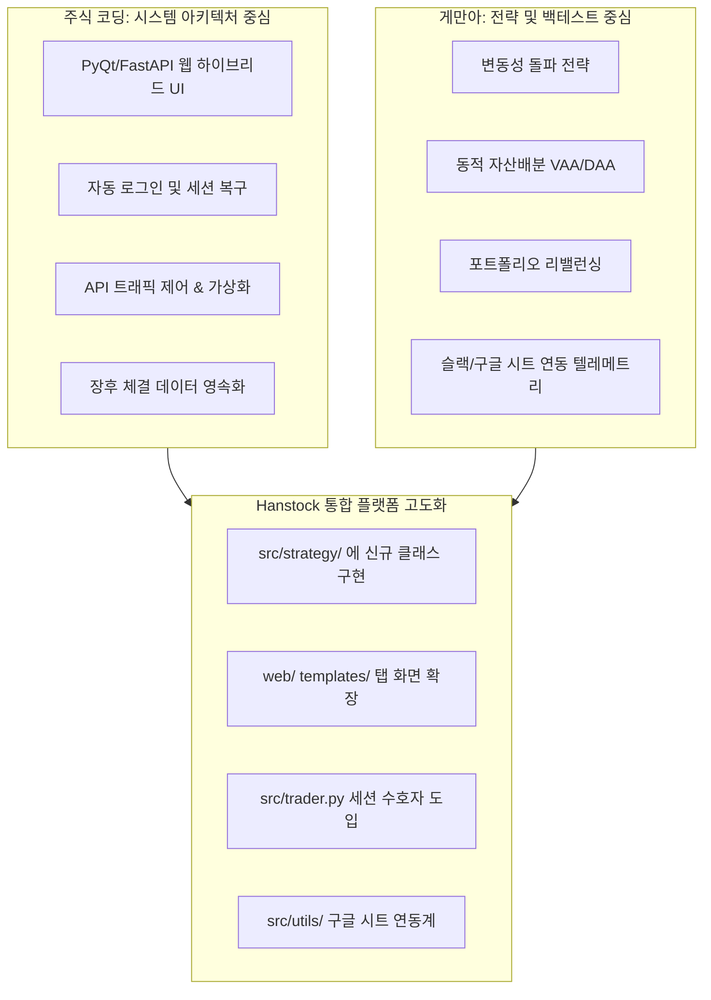

# S4.주식코딩_게만아_연계설계

이 문서는 국내 대표 주식 자동매매/퀀트 개발 유튜브 채널인 **'주식 코딩(Stock Coding)'**과 **'게만아(게으른 아빠의 자동매매)'**의 핵심 기술 및 투자 전략을 전수 분석하여, **Hanstock 플랫폼에 유기적으로 통합하고 기능을 고도화하기 위한 시스템 설계도**입니다.

---

## 1. 두 채널의 핵심 철학 및 기술 매핑



---

## 2. 게만아(Gemana) 퀀트 전략 통합 설계

게만아 채널의 시그니처인 **래리 윌리엄스 변동성 돌파 전략(Volatility Breakout)**과 **동적 자산 배분(Dynamic Asset Allocation)**을 Hanstock의 모듈러 구조에 맞게 이식합니다.

### ① 래리 윌리엄스 변동성 돌파 전략 (`src/strategy/volatility_breakout.py`) [NEW]
*   **원리**: 전일 고가와 저가의 폭(Range)에 돌파 계수 $k$(보통 0.5)를 곱한 값을 오늘 시가에 더해 목표 매수가(Target Price)를 설정합니다. 당일 주가가 목표가를 돌파하면 즉시 매수하고, 다음 날 시가에 기계적으로 매도합니다.
*   **구현 설계**:
    *   `src/strategy/volatility_breakout.py` 파일을 신설하여 `VolatilityBreakoutStrategy` 클래스를 정의합니다.
    *   KIS API 또는 `yfinance`를 통해 일봉 데이터를 수집하고, 실시간 호가 조회 파이프라인과 결합합니다.

#### 📝 [NEW] `src/strategy/volatility_breakout.py` 뼈대 코드
```python
from typing import Dict, Any, List
from src.config import config
from src.utils.logger import logger
import math

class VolatilityBreakoutStrategy:
    def __init__(self, k: float = 0.5):
        self.k = k

    def calculate_target_price(self, daily_data: List[Dict[str, Any]]) -> float:
        """전일 데이터를 바탕으로 당일 돌파 목표 매수가 계산"""
        if len(daily_data) < 2:
            raise ValueError("최소 2일 이상의 일봉 데이터가 필요합니다.")
        
        # daily_data는 날짜 오름차순 정렬 상태로 가정 (가장 마지막이 전일 일봉)
        prev_day = daily_data[-1]
        
        high = float(prev_day.get("stck_hgpr", prev_day.get("High", 0)))
        low = float(prev_day.get("stck_lwpr", prev_day.get("Low", 0)))
        close = float(prev_day.get("stck_clpr", prev_day.get("Close", 0)))
        
        # 변동폭 계산
        volt_range = high - low
        
        # 오늘 시가 기준 목표가 = 오늘 시가 + (변동폭 * k)
        # 당일 장중 스캔일 경우, KIS 실시간 시가 조회 필요
        # yfinance 배치일 경우 당일 시가(Open) 활용
        target_price = close + (volt_range * self.k)
        return target_price

    def generate_signal(self, current_price: float, target_price: float, holding_qty: int) -> Dict[str, Any]:
        """실시간 주가를 비교하여 매수/매도 시그널 생성"""
        if holding_qty == 0 and current_price >= target_price:
            return {
                "action": "buy",
                "reason": f"변동성 돌파 감지 (목표가: {target_price:,.0f} <= 현재가: {current_price:,.0f})",
                "indicators": {"target_price": target_price, "current_price": current_price}
            }
        elif holding_qty > 0:
            # 변동성 돌파 전략은 기본적으로 익일 시가에 매도하나,
            # 당일 익절/손절 조건(Seven Split의 로직 결합)도 가미 가능
            return {"action": "hold", "reason": "포지션 유지 (익일 장초반 일괄 청산 예정)"}
        
        return {"action": "hold", "reason": "돌파 대기 중"}
```

---

### ② 동적 자산 배분 전략 (Dynamic Asset Allocation)
*   **원리**: 미국 ETF(SPY, QQQ, IEF, GLD 등)의 모멘텀 지수(최근 1, 3, 6, 12개월 수익률 가중합)를 계산하여, 모멘텀이 가장 강한 공격형 자산에 집중 투자하거나, 시장이 하락세일 경우 안전 자산(채권, 현금)으로 자동 피신(Flight-to-Safety)합니다.
*   **구현 설계**:
    *   `src/strategy/asset_allocation.py` 클래스를 설계하여, `WATCHLIST` 기반의 해외/국내 자산 모멘텀 스코어를 계산하고 매일 자산 비중 리밸런싱 주문을 자동 생성합니다.

---

## 3. 주식 코딩(Stock Coding) 시스템 아키텍처 연계 설계

주식 코딩 채널의 강점인 **예외 처리 복구 시스템**, **트래픽 초과 제어**, 그리고 **대시보드 텔레메트리**를 백엔드 아키텍처에 구현합니다.

### ① 세션 수호자 (Session Guardian) 구현
*   **배경**: 증권사 API 토큰은 24시간 후 만료되거나 예기치 않게 세션이 끊길 수 있습니다. Uvicorn 백엔드가 도는 동안 세션 끊김으로 매매 주문이 누락되는 일을 막아야 합니다.
*   **설계**:
    *   `src/trader.py` 내부에 백그라운드 스레드로 **SessionGuardian**을 동작시킵니다.
    *   10분마다 KIS API에 더미 잔고 조회(Heartbeat)를 날리고, `401 Unauthorized` 또는 토큰 만료 에러 감지 시 즉시 기존 토큰 파일(`.data/kis_token.json`)을 삭제하고 새 토큰을 재발급받아 커넥션을 복구합니다.

### ② API 속도 제한 큐 (Rate Limit Control Queue)
*   **배경**: 한국투자증권 Open API는 초당 요청 수(TPS) 제한이 실계좌 20회, 모의계좌 10회 수준으로 엄격합니다. 대량의 매수 후보 종목을 루프 돌며 주문을 날릴 때 순식간에 차단될 수 있습니다.
*   **설계**:
    *   현재 `trader.py`에 적용된 단순 `_kis_order_throttle()` 락을 **토큰 버킷(Token Bucket) 알고리즘** 기반의 미들웨어 큐로 업그레이드합니다.
    *   모든 KIS API 아웃바운드 호출을 하나의 비동기 데몬 큐를 거쳐 전송하게 하여 물리적으로 0.1초의 강제 마이크로 간격을 유지합니다.

---

## 4. Hanstock 소스 코드 단위 구체적 수정 가이드

### 🛠️ 1) `src/strategy/router.py` 확장
새로운 전략 계열(`volatility_breakout`, `asset_allocation`)이 추가되더라도 기존 코드를 해치지 않고 `OrderRouter`가 이를 동적으로 매핑하도록 확장합니다.

```python
# MODIFY: src/strategy/router.py의 라우팅 구조 변경 예시
from src.strategy.volatility_breakout import VolatilityBreakoutStrategy

class OrderRouter:
    def __init__(self, api):
        self.api = api
        self.vbo_strategy = VolatilityBreakoutStrategy(k=0.5)

    def route_by_strategy(self, strategy_type: str, context: dict) -> dict:
        if strategy_type == "seven_split":
            # 기존 세븐 스플릿 매매 라우팅
            pass
        elif strategy_type == "volatility_breakout":
            # 변동성 돌파 기반 라우팅 집행
            target = self.vbo_strategy.calculate_target_price(context["daily_data"])
            signal = self.vbo_strategy.generate_signal(
                context["current_price"], target, context["holding_qty"]
            )
            return self.execute_signal(signal)
```

### 🛠️ 2) `src/dashboard.py`에 전략 백테스팅 & 시각화 API 연계
*   게만아 스타일의 수익률 분석을 화면에서 직관적으로 파악할 수 있도록 **백테스팅 탭**을 대시보드에 신설합니다.
*   `web/templates/index.html` 하위에 자산별 실시간 할당 비율과 변동성 돌파 기준선(목표 매수가 차트)을 시각화해 주는 Chart.js 스크립트를 확장 삽입합니다.

---

## 5. 단계별 적용 및 검증 로드맵

```text
[1단계: 안전 지대 구축]
- src/trader.py 세션 수호자 (Session Guardian) 스레드 가동
- KIS API 트래픽 제어 버킷 큐 설계 및 유닛 테스트 검증

[2단계: 전략 컴포넌트 이식]
- src/strategy/volatility_breakout.py 신설 및 yfinance 데이터 정합성 검증
- tests/test_volatility_breakout.py (100% 테스트 커버리지 구축)

[3단계: 대시보드 관제 레이어 결합]
- web/templates/index.html 및 ai_dashboard.html UI에 변동성 돌파 목표선 차트 추가
- 슬랙(Slack) 알림에 게만아 스타일 일일 운용 자산(Equity Curve) 변화 추이 보고 양식 연동
```

---

## 6. 결론

본 설계를 적용함으로써 Hanstock 플랫폼은 단순히 주식을 분할 매수/매도하는 기계적 룰셋 단계(Seven Split)를 넘어, **시장 국면에 따라 자산 비중을 스스로 튜닝하고(자산 배분), 변동성이 터지는 주도주를 당일 고속 거래하는(변동성 돌파) 하이브리드 자동매매 시스템**으로 고도화됩니다. 

또한 주식 코딩 채널의 견고한 예외 처리 노하우를 접목하여 24시간 끊김 없는 무중단 라이브 트레이딩 환경을 완성할 수 있습니다.
