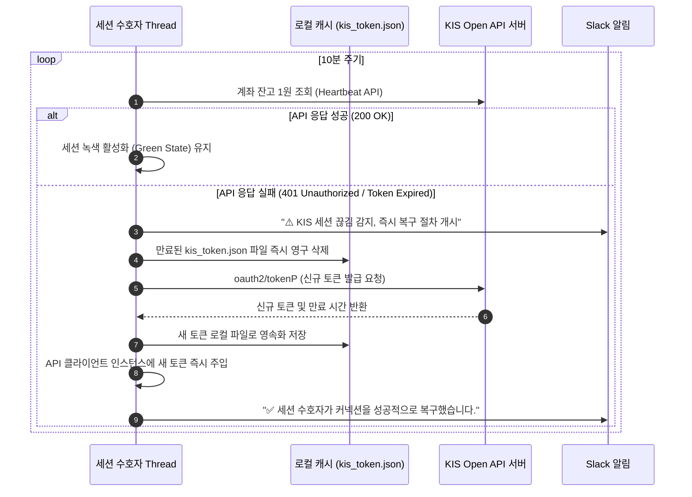
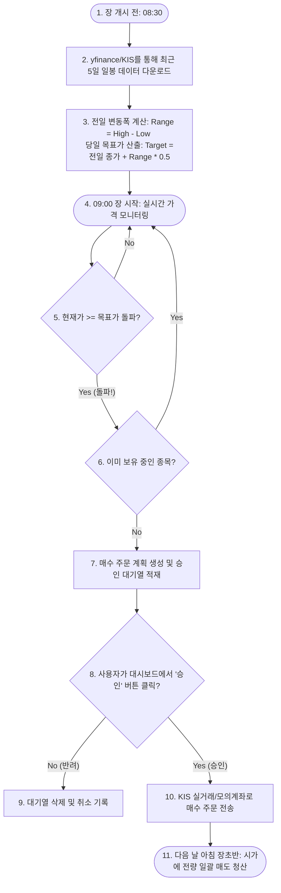

# S5.하이브리드대시보드_기능정의서

이 문서는 **주식 코딩의 예외 처리 아키텍처**와 **게만아의 퀀트 투자 전략**을 이식한 Hanstock 하이브리드 대시보드의 **모든 세부 기능과 구체적인 동작 흐름(Operation Flow)**을 사용자가 한눈에 이해하고 검증할 수 있도록 정리한 한글 기능 정의 및 동작 설명서입니다.

---

## 1. 하이브리드 대시보드 핵심 기능 목록 (Feature Matrix)

하이브리드 대시보드는 크기 세 개의 관제 영역(주식 엔진, 해외선물 엔진, 시스템 수호자)과 환경설정 패널로 구성됩니다.

| 영역 | 기능명 | 주요 역할 | 동작 트리거 |
| :---: | :--- | :--- | :--- |
| **시스템 수호자** | **세션 수호자 (Session Guardian)** | KIS API 접속 끊김 감지 및 토큰 자동 재발급/세션 복구 | 10분 주기 백그라운드 폴링(Heartbeat) |
| **시스템 수호자** | **속도 제한 버킷 (TPS Guard)** | KIS API 속도 제한(초당 10~20회) 초과로 인한 거부 오류 원천 방지 | 모든 KIS API 요청 전송 직전 |
| **주식 엔진** | **변동성 돌파 감지기** | 당일 주도주를 대상으로 래리 윌리엄스 돌파 타겟 계산 및 실시간 돌파 모니터링 | 장중 실시간 틱 데이터 수집 시 |
| **주식 엔진** | **동적 자산 배분기 (VAA/DAA)** | 주식/채권/원자재 ETF의 모멘텀 스코어를 계산해 안전/공격형 비중 자동 튜닝 | 매일 아침 장 개시 전 (08:30) |
| **주식 엔진** | **주문 승인 대기열 (Queue)** | `REQUIRE_APPROVAL` 모드 시 자동 생성된 매매 계획을 보류하고 사용자의 최종 승인 대기 | 매수/매도 시그널 조건 충족 시 |
| **해외선물** | **Telegram 시그널 파서** | 텔레그램 채널의 정형/비정형 신호를 정규표현식 및 Claude LLM으로 정규화 | 텔레그램 메시지 수신 즉시 |
| **해외선물** | **선물 주문 실행기** | 파싱된 해외선물 신호(진입가, SL, TP)를 대시보드에서 1-Click으로 시장 전송 | 사용자의 '선물 매매 집행' 클릭 시 |

---

## 2. 구체적인 시나리오별 동작 흐름 (Operation Flows)

시스템의 각 기능이 백엔드와 프론트엔드에서 어떻게 맞물려 돌아가는지 단계별 프로세스로 기술합니다.

### 🔄 ① 세션 수호자 (Session Guardian) 동작 흐름

---

### 📈 ② 변동성 돌파 전략 실행 및 매매 프로세스

사용자가 아침에 대시보드를 켜고 저녁에 마감할 때까지 변동성 돌파 전략이 가동되는 방식입니다.

---

### 🛡️ ③ 주문 승인 대기열 (Approval Queue) 동작 프로세스

실제 주문이 시장에 잘못 나가는 실수를 완벽하게 제어하기 위한 수동 확인 동작 가이드입니다.

1.  **시그널 탐지**: 세븐 스플릿 또는 변동성 돌파 전략이 매수 타겟을 감지합니다.
2.  **임시 적재**: `REQUIRE_APPROVAL=true` 상태이므로 주문은 곧바로 증권사로 가지 않고 SQLite `approvals` 테이블에 `pending` 상태로 인서트됩니다.
3.  **사용자 알림**: Slack 웹훅을 통해 `"📌 [승인 대기] 삼성전자 10주 매수 계획이 등록되었습니다. 대시보드에서 승인해 주세요."` 알림이 발송됩니다.
4.  **대시보드 노출**: 대시보드 메인 화면의 **[주문승인 대기열]** 테이블에 해당 건이 추가됩니다. (종목코드, 종목명, 매수/매도, 수량, 단가, 발생 원인 표기)
5.  **동작 처리**:
    *   **[승인(Approve)] 클릭 시**: 상태가 `approved`로 변경되고, `OrderRouter`가 활성화되어 KIS API로 즉시 물리 주문을 제출합니다. 체결 결과를 대시보드 화면에 즉각 표시합니다.
    *   **[반려(Reject)] 클릭 시**: 상태가 `rejected`로 업데이트되고 주문은 증권사로 나가지 않고 소멸되어 안전이 유지됩니다.

---

## 3. 대시보드 화면상에서의 사용자 작동 가이드 (User Manual)

대시보드에 접속한 뒤 각 기능을 올바르게 파악하고 조작하는 방법입니다.

### 🖥️ 1단계: 서버 상태 및 세션 가동 점검
*   대시보드 좌측 상단의 **[Session Guardian]** 위젯을 확인합니다.
    *   `🟢 Online`: 증권사 통신 토큰이 싱싱하며 실시간 매매 및 조회가 가능한 상태입니다.
    *   `🔴 Offline`: KIS API 키설정이 누락되었거나 만료 상태입니다. `환경설정` 탭으로 이동하여 키를 갱신해야 합니다.

### ⚙️ 2단계: 환경변수 및 투자 성향 설정
*   **[환경설정]** 메뉴로 진입하여 실시간 조율을 진행합니다.
    *   **주문 차단 (DRY_RUN)**: 실거래 연동 전 반드시 `true`로 설정하여 시스템이 계획만 수립하게 만듭니다. 충분히 신호 신뢰도를 확인한 후에 `false`로 돌립니다.
    *   **실전매매 최종허용 (ENABLE_LIVE_TRADING)**: 실계좌(`real`)로 진짜 돈을 거래할 때 최종적으로 켜야 하는 마스터 스위치입니다.

### 📊 3단계: 매수 후보 발굴 및 목표가 트래킹
*   **[신호/계획]** 탭에서 당일 변동성 돌파 전략의 타겟 종목들과 각 종목의 **목표가(Target Price)**를 대조해 봅니다.
*   현재가가 목표가를 돌파하는 순간 우측 실시간 이벤트 로그 창에 로그가 팝업되며 주문 승인 큐에 빨간 불이 들어오는지 체크합니다.
