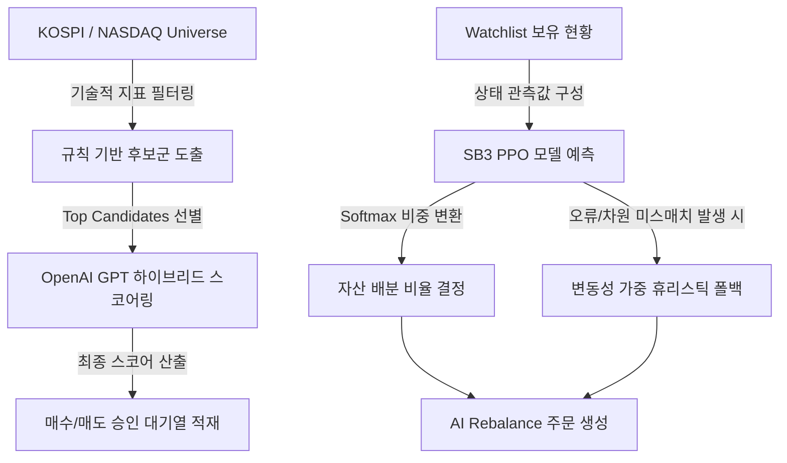

# Hanstock & Mistock 프로젝트 AI 전략 분석 보고서

본 보고서는 Hanstock 및 Mistock 프로젝트에 구현되어 있는 AI 거래 및 자산 배분 전략의 구조와 알고리즘, 그리고 한계점과 개선 방안을 분석합니다.

---

## 1. AI 전략 개요

프로젝트에는 크게 **두 가지 상호 보완적인 AI 전략 레이어**가 구축되어 있습니다.

1. **후보 종목 하이브리드 필터링 (LLM 활용 스코어링)**
   - 규칙 기반(Rule-based) 지표로 1차 선별된 후보 종목들에 대해 대형 언어 모델(OpenAI GPT)을 활용하여 최종 매수 확률과 판단 근거를 산출하는 하이브리드 방식입니다.
2. **포트폴리오 비중 배분 (강화학습 PPO 모델)**
   - FinRL 스타일의 자산 배분 환경을 모방한 커스텀 Gymnasium 환경([rl_env.py](file:///C:/MSF-LOC/workstudy/hanstock/src/rl_env.py))에서 학습된 PPO(Proximal Policy Optimization) 모델을 사용하여 보유 관심 종목(Watchlist) 간 최적 자산 배분 비율을 결정하는 방식입니다.

---

## 2. 전략 1: 후보 종목 LLM 하이브리드 스코어링

### 2.1 동작 메커니즘
- **클래스 및 파일**: [ModelPredictor](file:///C:/MSF-LOC/workstudy/hanstock/src/strategy/predict.py#L12) & [seven_split.py](file:///C:/MSF-LOC/workstudy/hanstock/src/strategy/seven_split.py#L716-L746)
- **1차 필터링**: RSI, MACD, SMA 20/60선 가등을 종합하여 0.0 ~ 5.0 점 사이의 로컬 규칙 점수(`rule_score`)를 매깁니다.
- **2차 AI 스코어링**: 상위 후보군(기본값 최대 5종목, `ai_candidate_limit`)에 대해 보조 지표 정보 및 5일/20일 변동성, MDD, 거래량 비율 등의 정량 피처([build_strategy_features](file:///C:/MSF-LOC/workstudy/hanstock/src/strategy/features.py#L72))를 JSON 형태로 OpenAI GPT에 전달합니다.
- **프롬프트 및 API 구성**:
  - OpenAI의 `json_schema` 모드를 사용하여 정형화된 JSON(`probability`, `rationale`) 결과물만 반환받도록 제어합니다.
  - 예측 확률 `probability` (0.0 ~ 1.0)에 5.0을 곱하여 `ml_score` (0.0 ~ 5.0)로 환산합니다.
- **스코어 가중치 결합 (Hybrid Score)**:
  - 설정 가중치(`ai_score_weight`, 기본값 0.4)를 기준으로 결합합니다.
  $$\text{Final Score} = (\text{Rule Score} \times 0.6) + (\text{ML Score} \times 0.4)$$

### 2.2 장점 및 특징
- **캐싱(Cache) 적용**: OpenAI API 호출 비용 절감 및 대시보드 로딩 성능을 보장하기 위해 피처 데이터를 해시값으로 변환하여 `.runtime/openai_ai_cache.json` 파일에 로컬 캐싱합니다.
- **토큰 사용량 모니터링**: KIS API 호출 데이터와 결합하여 매 요청 시 소모되는 OpenAI API 토큰을 트래킹하고 DB에 영구 기록합니다.

---

## 3. 전략 2: 강화학습 PPO 자산 배분 (AI Rebalance)

### 3.1 강화학습 환경 디자인 ([rl_env.py](file:///C:/MSF-LOC/workstudy/hanstock/src/rl_env.py))
- **상태 공간(State Space)**: `Box(low=-inf, high=inf, shape=(len(tickers) * 4,))`
  - 각 종목별로 4가지 관측치(State)를 추출하여 연결합니다:
    1. **정규화된 현재가** (`price / 100,000.0`)
    2. **정규화된 RSI** (`rsi / 100.0`)
    3. **정규화된 MACD Histogram** (`macd / 1000.0`)
    4. **이동평균 추세 편차** (`(Close - SMA60) / SMA60`)
- **행동 공간(Action Space)**: `Box(low=-1, high=1, shape=(len(tickers),))`
  - 각 행동 값에 지수 함수(Exponential) 및 Softmax 연산을 거쳐 총 자산 합계가 1.0(또는 현금 버퍼를 제외한 가용 비율) 이하가 되도록 주식별 목표 비중(Target Weights)을 도출합니다.
- **보상 구조(Reward)**:
  - 당일 설정된 목표 비중을 기준으로 다음 날 발생하는 포트폴리오의 로그 수익률($\text{Return} \times 100$)을 즉시 보상으로 제공하여 장기 누적 자산 가치를 극대화하도록 유도합니다.

### 3.2 런타임 비중 결정 알고리즘 ([seven_split.py](file:///C:/MSF-LOC/workstudy/hanstock/src/strategy/seven_split.py#L289-L380))
- **강화학습 모델 연동**: `data/trained_models/ppo_kr_stock.zip` 에 학습 완료된 PPO 파일이 존재할 경우 이를 자동으로 불러와 실시간 비중 배분을 예측합니다.
- **차원 예외 보호 장치**:
  - 감시 목록(Watchlist)의 종목 개수가 변경되면 상태 공간 차원(종목 개수 $\times$ 4)이 변하여 모델 입력 텐서 미스매치 에러가 발생합니다.
  - 이 경우 혹은 모델 파일이 부재할 시 **"변동성 역수 가중 및 추세 점수 휴리스틱 모델"**로 자동 폴백(Fallback)되어 중단 없이 비중 계획을 수립합니다.

---

## 4. AI 전략 레이어의 주요 위험 요인 및 개선 방안

| 분류 | 현상 및 문제점 | 개선 및 추천 사항 |
| :--- | :--- | :--- |
| **Watchlist 연동 문제** | 사용자가 웹에서 Watchlist 종목을 추가/삭제하면 RL 모델 상태 공간의 입력 차원(`len(WATCHLIST) * 4`)이 바뀌어 PPO 예측이 항상 에러(WinError 또는 Shape Mismatch)를 뱉고 Heuristic으로 폴백됩니다. | 개별 종목 개수에 결합되지 않도록 **단일 종목 단위의 상태/행동 네트워크**로 설계를 변경하거나, 입력 차원이 고정된 Watchlist에 대해서만 RL을 독립 구동해야 합니다. |
| **OpenAI 비용 및 성능** | 실시간 대시보드 조회나 스케줄 주기가 잦을 경우, 캐싱을 우회하는 신규 데이터 발생 시 실시간 외부 API 대기로 인해 대시보드 반응성이 떨어지며 비용 부담이 증가합니다. | OpenAI 스코어링은 실시간 대시보드 뷰에서 분리하여 **백그라운드 스케줄러 배치 타스크**로 주기적으로 갱신하고 DB에 적재된 점수를 뷰어가 읽어가게 수정할 것을 권장합니다. |
| **데이터 결측 대응** | `SimpleStockTradingEnv` 학습 시 특정 상장일이 짧은 신생 기업이나 임시 거래 정지 종목의 경우, yfinance 데이터 결측값 발생 시 중립 기본값(`rsi=50.0`, `price=0.0`)으로 채워져 모델 왜곡을 유발할 수 있습니다. | 결측 데이터가 많은 종목은 포트폴리오 스캔 우주(Universe)에서 조기 제거하거나 결측치 보간(Interpolation)을 거치도록 전처리 파이프라인을 강화해야 합니다. |

---
## 5. 결론 및 향후 계획

현재 구조는 규칙 기반의 안정성에 최첨단 AI 지능(LLM 판단력 및 PPO 자산 최적화 비율)을 결합하여 합리적인 의사결정 프로세스를 보유하고 있습니다. 다만, 감시 종목 개수의 가변성으로 인해 강화학습 모델이 자주 폴백 모드로 작동하므로, 실운용 시 이를 고정 우주(Universe)로 제한하여 강화학습 모델의 실제 성능을 이끌어내거나 고도화된 스펙의 단일 자산 에이전트 모델로의 점진적 업그레이드가 필요합니다.
