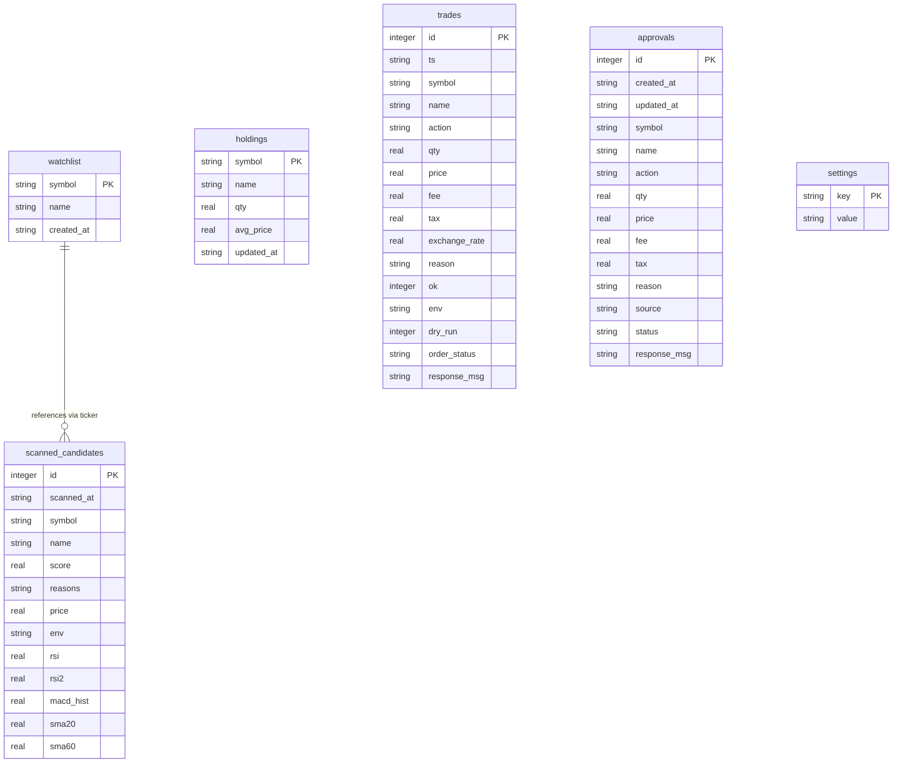
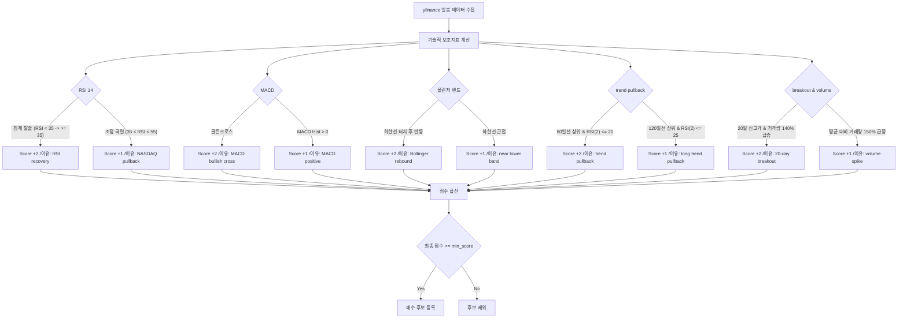
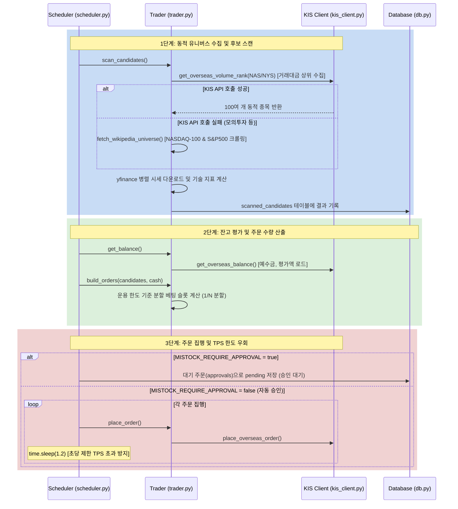

# 미스톡(Mistock) 해외 주식 자동매매 시스템 분석 보고서

본 보고서는 최근 개선된 **해외주식 동적 유니버스 수집 구조**, **KIS API TPS 제한(초당 거래건수 초과) 회피 딜레이**, 그리고 **대시보드 통화 단위($) 정정 사항**을 반영하여 미스톡(Mistock) 프로젝트의 아키텍처와 소스 코드, 데이터베이스 및 핵심 알고리즘을 분석한 결과입니다.

---

## 📂 1. 프로젝트 파일 구성 및 역할

미스톡은 국내 주식 자동매매 시스템인 한스톡(Hanstock)의 아키텍처 패턴을 공유하면서도, 미국 시장(NASDAQ/NYSE)의 거래 규칙, yfinance 마켓 데이터, KIS 해외주식 API 및 가상거래(Paper) 기능을 지원하기 위해 독립된 패키지로 구축되어 있습니다.

| 파일/디렉터리 | 주요 역할 및 기능 |
| :--- | :--- |
| **[src/mistock/config.py](file:///C:/MSF-LOC/workstudy/hanstock/src/mistock/config.py)** | 미국 주식 거래 환경 설정(환경변수 `MISTOCK_*` 로딩). 운용 자금 한도, 분할 횟수, 손절/익절 마진, RSI 매수/매도 임계값, 타임아웃초 및 기본 폴백 유니버스(100종목) 정의. |
| **[src/mistock/db.py](file:///C:/MSF-LOC/workstudy/hanstock/src/mistock/db.py)** | 미스톡 전용 SQLite 데이터베이스(`.runtime/mistock/trades.sqlite`) 연결 및 테이블 초기화(`init_db`). 기본 관심종목(10개) 최초 인서트 및 설정(settings) 관리 헬퍼. |
| **[src/mistock/strategy.py](file:///C:/MSF-LOC/workstudy/hanstock/src/mistock/strategy.py)** | **[핵심 전략 & 동적 수집]** 룰 기반 기술적 분석 알고리즘(`strategy_profile`). KIS 해외 거래대금 상위 API 호출 및 Wikipedia 크롤러를 조합한 3단계 동적 유니버스 수집기(`build_scan_universe`) 정의. |
| **[src/mistock/trader.py](file:///C:/MSF-LOC/workstudy/hanstock/src/mistock/trader.py)** | **[매매 핵심 엔진]** 잔고 조회, 주문 실행 및 대기 등록, 스캔 후보군 생성(`scan_candidates`) 총괄. KISClient API와 결합하여 주문 전송 및 거래 내역 영속화. |
| **[src/mistock/scheduler.py](file:///C:/MSF-LOC/workstudy/hanstock/src/mistock/scheduler.py)** | **[스케줄러/데몬]** 미장 거래 시간 주기별 스캔, 매도/매수 시그널 분석, 주문 집행 루프. KIS API 호출 간 TPS 제한 우회 딜레이(`time.sleep`) 처리. |
| **[src/dashboard/routes/mistock.py](file:///C:/MSF-LOC/workstudy/hanstock/src/dashboard/routes/mistock.py)** | 대시보드 API 엔드포인트 패키지. 관심종목 관리, 후보 스캔 실행, 대기 주문 승인/거절, AI 전략 적용 프리셋, 모의 잔고 현황 반환 등 처리. |
| **[web/static/js/mistock_app.js](file:///C:/MSF-LOC/workstudy/hanstock/web/static/js/mistock_app.js)** | 미스톡 프론트엔드 핵심 제어 스크립트. 차트 렌더링, 주문 관리, 관심종목 추가/삭제, 대시보드 뷰 업데이트 및 통화 단위($) 렌더링. |

---

## 🗄️ 2. 데이터베이스 스키마 및 영속성 (trades.sqlite)

미스톡은 국내 주식용 DB와 완전히 격리된 별도의 DB인 `.runtime/mistock/trades.sqlite`를 사용합니다.

*   **`holdings`**: 현재 가상/실제 계좌에 보유 중인 미국 주식 잔고.
*   **`watchlist`**: 사용자가 대시보드에서 등록하거나 전략 조건에 의해 자동 추가된 관심 종목 목록.
*   **`trades`**: 체결 완료된 매수/매도 거래의 이력 기록 (수수료, 제세금, 적용 환율 포함).
*   **`approvals`**: 자동매매 승인제(`MISTOCK_REQUIRE_APPROVAL=true`) 하에서 승인을 대기하는 주문 보관 테이블.
*   **`scanned_candidates`**: 주기적 스캔을 통해 발굴된 종목의 점수와 보조지표 이력 보관.

---

## 📈 3. 트레이딩 전략 분석 (`strategy_profile`)

미스톡의 기본 규칙은 기술적 분석 지표 5가지를 스코어링하여 매매 후보를 선정하는 룰 기반 전략입니다.

---

## ⚙️ 4. 스캔 및 자동 주문 집행 파이프라인

미스톡은 다음과 같은 프로세스로 미국 시장 평일 밤(한국 시간 밤 22:30 ~ 익일 새벽 05:00)에 스케줄러를 통해 자동매매를 실행합니다.

---

## 💡 5. 최근 개선 사항 핵심 분석

최근 미스톡 프로젝트에 적용된 정교한 기능들은 다음과 같습니다.

### A. KIS API 및 Wikipedia 크롤링 연동 3단계 동적 빌더
*   **문제점:** 이전에는 스캔 대상이 `.env` 파일에 100개 주식이 정적으로 하드코딩되어 있어 시장 상황에 따른 거래량 변화나 주도주 변화를 반영하지 못했습니다. 또한 `init_db`에서 DB에 무차별적으로 100개 관심종목을 인서트하는 등의 데이터 왜곡이 있었습니다.
*   **해결책:** `build_scan_universe()` 함수를 구현하여, 실전 투자 시 KIS OpenAPI의 **해외주식 거래대금 순위 API**(`HHDFS76320010`)를 동적으로 호출하여 시장 주도주를 포착하고, 모의투자 환경 등 API 호출이 안 될 때는 **Wikipedia 웹 페이지를 실시간 파싱**하여 최신의 `NASDAQ-100` 및 `S&P 500` 구성 종목을 동적으로 빌드하도록 하였습니다.

### B. KIS API 초당 거래제한(TPS) 에러 우회 처리
*   **문제점:** 대기 주문(Approvals) 일괄 승인 시 또는 다량의 매도 시그널 집행 시, `time.sleep` 대기 없이 연속해서 API를 전송하여 KIS 웹서버로부터 `"초당 거래건수를 초과하였습니다."` 메시지와 함께 주문이 무더기 거절되는 결함이 있었습니다.
*   **해결책:** 매수뿐만 아니라 `scheduler.py`의 **매도 루프** 및 `routes/mistock.py`의 **일괄 자동 승인 루프**(`_auto_approve_mistock_pending_approvals`)에도 주문 간 대기 시간을 적용하여 안정적인 주문 발주 환경을 확보했습니다.

### C. 통화 기호 $ (달러) 전면 적용
*   **문제점:** 미국 주식 대시보드임에도 불구하고 단가가 `292 원` 등 한화 단위 기호가 하드코딩되어 출력되었습니다.
*   **해결책:** `mistock_app.js` 내의 모든 테이블 렌더링부, 차트 축 레이블, 기준 자본 표기 등을 `$` 및 `달러`로 정정하여 프리미엄 해외 주식 대시보드에 맞는 시각 환경을 조성했습니다.
