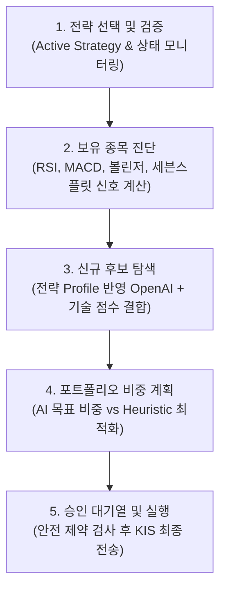

# 📊 전략 탭 (Strategy Tab) 통합 분석 보고서

이 보고서는 `doc/` 폴더에 포함된 전략 탭 관련 3대 핵심 문서 및 설명서를 분석하여, 한스톡 대시보드의 전략 운영 흐름, 현재 구현 현황(78%), 남은 과제(17%p), 그리고 안전성 통제 및 백테스트 방안을 종합 정리한 분석 보고서입니다.

---

## 🔍 1. 분석 대상 문서 개요

| 파일명 | 작성일 | 주요 내용 |
| :--- | :---: | :--- |
| [전략탭\_통합분석\_재설계안.md](file:///C:/MSF-LOC/workstudy/hanstock/doc/전략탭_통합분석_재설계안.md) | 2026-06-01 | 화면 분산 해소 및 AI 전략 검증 생명주기 도입을 위한 아키텍처 및 인터페이스 설계 |
| [전략탭\_구현진행현황.md](file:///C:/MSF-LOC/workstudy/hanstock/doc/전략탭_구현진행현황.md) | 2026-06-01 | 설계안 대비 현재 구현율(78%) 평가, 완료된 API/UI 작업 명세 및 95% 완료 로드맵 |
| [AI전략탭\_개선사항.md](file:///C:/MSF-LOC/workstudy/hanstock/doc/AI전략탭_개선사항.md) | 2026-06-01 | 외부 표준(NIST AI RMF, FINRA 통제안, QuantConnect)에 맞춘 AI 프롬프트, Structured Outputs 스키마 및 캐시 설계 |
| [S1.한스톡사용설명서.md](file:///C:/MSF-LOC/workstudy/hanstock/doc/S1.한스톡사용설명서.md) | 2026-06-01 | 로컬 및 VM 실행, 환경 변수 구성, 실거래 안전장치 등 한스톡 통합 운영 매뉴얼 |

---

## 💡 2. 기존 전략 탭의 문제점 (As-Is)

재설계 작업 시작 전, 기존 대시보드는 다음과 같은 핵심적인 한계점을 지니고 있었습니다.

1. **화면 분산에 따른 파이프라인 단절**
   - 사용자는 `AI 전략 탭`(전략 선택) → `신호/계획 탭`(매수 후보 탐색) → `AI 탭`(목표 비중 계산) → `주문승인 탭`(최종 승인)을 계속 번갈아 가며 조작해야 했습니다. 하나의 일관된 '전략 실행 파이프라인'으로 시각화되지 못했습니다.
2. **전략 '선택'과 '반영'의 불일치**
   - AI 전략 탭에서 체크박스로 다중 선택할 수 있는 것처럼 보였으나, 실제 백엔드 연동은 목록의 첫 번째 전략만 `select-ai-ranker` 드롭다운에 강제로 노출시키는 단일 랭커 방식이었습니다.
3. **전략 설명(`description`)의 유명무실함**
   - 사용자가 '단기 반등형', '보수적 저변동성' 등의 설명을 적어 전략을 신설할 수 있었으나, 이 텍스트가 OpenAI API 호출 시 프롬프트에 주입되지 않아 실제 예측 점수와 결과에 영향을 주지 못했습니다.
4. **검증 프로세스의 부재**
   - 신규 생성된 AI 전략이 즉시 적용될 수 있어 사전 백테스트나 모의운용(Paper Trading)을 강제하는 안전 게이트가 없었습니다.

---

## 🛠️ 3. 전략 탭 재설계 및 구현 아키텍처 (To-Be)

문서 분석을 통해 도출된 핵심 설계 방향 및 구현 구조는 다음과 같습니다.

### 🔄 3.1 5단계 통합 전략 파이프라인
전략 탭은 화면을 이리저리 옮겨 다니지 않고, 아래 흐름을 한눈에 보고 제어하도록 재구성되었습니다.



### 🗄️ 3.2 데이터 모델 및 생명주기 통제
* **데이터 모델 확장**: `ai_strategies` 테이블에 `status`, `profile_json`, `strategy_version`, `profile_hash` 및 각 검증(Static, Backtest, Paper) 타임스탬프 필드가 보강되었습니다.
* **이벤트 로그 관리**: 신규 `ai_strategy_events` 테이블을 통해 전략의 생성, 갱신, 검증, 모의운용, 승인 등의 모든 생명주기 이벤트 트랙킹을 구현했습니다.
* **전략 상태 전이 규칙**: 다음과 같이 안전하고 엄격한 상태 전이(State Transition) 규칙을 적용합니다.

```text
[ Draft ] ──(정적 검증)──> [ Verified ] ──(백테스트)──> [ Backtested ] 
                             │
                             └──(모의운용 시작)──> [ Paper Running ] ──(기준 충족)──> [ Paper Passed ] ──(승인)──> [ Approved ] ──(비활성화)──> [ Retired ]
```

---

## 📈 4. 현재 구현 진행 현황 (준비도: 78%)

2026-06-01 추가 구현을 통해 백테스트/페이퍼 검증 게이트와 승인 제약 API가 1차 연결되어 **현재 전체 구현율은 약 78%** 수준에 도달했습니다.

### ✅ 4.1 완료된 주요 기능
* **Normalised Profile JSON**: AI 전략을 모델명 외에 `risk_level`, `max_ai_weight`, `min_rule_score_for_ai`, `allow_candidate_promotion` 등의 위험 제어 설정이 포함된 JSON 구조체로 규격화했습니다.
* **승인 게이트 제약 API**: `POST /api/ai-strategies/{id}/approve` 호출 시, 정적 검증 상태, API 검증 상태, 백테스트 결과, 모의 운용 필수 일수(`paper_trading_required_days`) 충족 여부를 확인하여 **조건 미충족 시 `409 Conflict`로 승인을 자동 차단**합니다.
* **추적 가능한 후보 히스토리**: `/api/candidates` 실행 결과를 `scanned_candidates` DB에 저장할 때, 당시에 사용된 `strategy_id`, `strategy_version`, `profile_hash`, `ai_fallback_reason` 등을 기록하여 투명한 오딧(Audit)이 가능하게 만들었습니다.
* **단일 Active 전략 기반 UX**: 다중 선택 체크박스의 오해를 줄이고 `GET /api/strategy-context`를 통해 하나의 "Active 전략 콘텍스트"로 UI 요약을 단일화했습니다.

### ⚠️ 4.2 남은 Gap (약 17%p, 95% 달성을 위한 과제)
1. **전략별 성과 분석 루프 (가장 핵심)**
   - 후보로 탐색된 후 N일(1일, 5일, 20일) 경과 시점의 실제 수익률을 추적하여 전략의 실효성을 비교 평가하는 기능.
2. **자동 승격 및 강등(Review Required) 트리거**
   - 모의운용 중 성과가 양호한 전략은 `Paper Passed`로 자동 승격하고, 승인 후 실전에서 MDD가 급증하거나 적중률이 하락한 전략은 `review_required` 또는 `retired`로 자동 강등하는 규칙 엔진 미비.
3. **이벤트 타임라인 UI 구현**
   - `ai_strategy_events`에 누적되는 생명주기 히스토리와 검증 리포트 상세(수익률, MDD, Win-rate 등)를 대시보드 화면상에서 예쁘게 시각화해 줄 모달 및 피드 영역 구축.

---

## 🔒 5. 외부 표준 및 안전(Safety) 통제 설계

문서에서는 NIST AI RMF 및 FINRA 알고리즘 트레이딩 가이드라인을 벤치마킹하여 견고한 리스크 장치를 설계해 두었습니다.

* **최소 룰 필터링 (`min_rule_score_for_ai`)**
  - 기술적 지표 점수가 극단적으로 낮은(예: 1.5점 미만) 종목은 AI 평가 대상에서 1차 차단하여 OpenAI 호출 비용 낭비와 지연시간을 방지합니다.
* **OpenAI Structured Outputs 규격화**
  - AI 스코어링 반환값을 `probability`(확률), `confidence`(확신도), `risk_flags`(위험 요소), `recommended_action` 등의 엄격한 스키마로 고정하여 안전하고 정형화된 응답을 보장합니다.
* **환경 변수 기반의 다중 안전망**
  ```text
  DRY_RUN=true               # 주문 API 실제 전송 차단 (계획 기록만 실행)
  TRADING_ENV=demo           # KIS 모의투자 환경 설정
  ENABLE_LIVE_TRADING=false  # 실거래 차단 최종 스위치
  REQUIRE_APPROVAL=true      # 대시보드 승인 대기열 필수 통과
  ```
  *특히 `status != approved` 상태인 미검증 전략은 실전 환경(`TRADING_ENV=real`)의 기본 전략으로 임명하는 것을 원천 거부합니다.*

---

## 🎯 6. 향후 권장 로드맵 제안

1. **1순위 (성과 추적 루프 완성)**: 후보 탐색 히스토리 종목들의 N일 후 가격 추적 배치 구현 및 전략 성과 테이블 적재.
2. **2순위 (상세 타임라인 UI)**: 전략 목록 옆 '이벤트 로그' 및 '백테스트 리포트' 상세 팝업 창 개발.
3. **3순위 (성능 기반 강등 엔진)**: MDD 초과 또는 연속 Fallback 발생 시 `review_required` 자동 상태 전이 구현.

이 방향을 유지하면서 개발이 진행된다면 단순 모니터링 수준을 넘어, **NIST AI RMF 기반의 고도화된 검증형 전략 트레이딩 대시보드**로 완성될 것으로 확신합니다.
