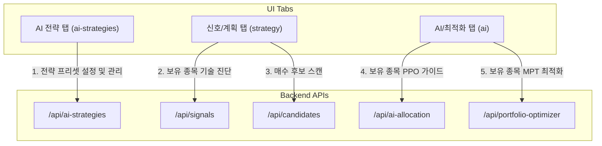

# 📊 대시보드 AI전략 및 신호/계획 탭 구조/중복 분석 보고서

본 보고서는 한스톡 대시보드의 세 가지 주요 전략적 탭인 **AI 전략(ai-strategies)**, **신호/계획(strategy)**, **AI/최적화(ai)**의 HTML 구조, Javascript 이벤트 런타임, 백엔드 API 및 자산 배분 비즈니스 로직을 비교 분석하여 중복 제거 및 구조 고도화 방안을 제안합니다.

---

## 1. 3대 전략 관련 탭의 구조 및 역할 분석

한스톡 대시보드는 현재 [index.html](file:///C:/MSF-LOC/workstudy/hanstock/web/templates/index.html#L44-L48)에 세 개의 서로 다른 탭으로 나누어 전략 기능들을 렌더링하고 있습니다.



### 1.1 AI 전략 탭 (`data-dashboard-tab="ai-strategies"`)
* **목적**: 시스템에 등록된 AI 모델(PPO 강화학습, OpenAI LLM 랭커 등) 및 투자 성향 프리셋(안정형/균형형/공격형)을 관리하고 검증(정적 검증, 백테스트, 페이퍼 트레이딩) 상태를 감시 및 활성화합니다.
* **주요 API**: 
  - `GET /api/ai-strategies`: 데이터베이스 of 모든 AI 전략 목록 획득
  - `GET /api/strategy-context`: 현재 바인딩된 Active 전략 획득
  - `POST /api/ai-strategies/{id}/select`: 활성 전략 선택

### 1.2 신호/계획 탭 (`data-dashboard-tab="strategy"`)
* **목적**: 활성화된 AI 전략 규칙에 기반하여 현재 포트폴리오 및 외부 시장 후보군을 진단하고 실거래 주문 계획을 추출합니다.
* **주요 API**:
  - `GET /api/signals`: [trader.py](file:///C:/MSF-LOC/workstudy/hanstock/src/trader.py)의 `generate_signal`을 이용한 보유 종목의 매도/보유 진단
  - `GET /api/candidates`: 관심 종목 + 거래량 상위 종목을 대상으로 랭커 및 오프티마이저를 가동하여 매수 후보 발굴
  - `GET /api/candidates/history`: 과거에 탐색되고 DB에 캐싱된 후보군 이력 조회

### 1.3 AI/최적화 탭 (`data-dashboard-tab="ai"`)
* **목적**: 현재 계좌에 보유 중인 종목들을 대상으로 AI 모델(PPO)과 현대 포트폴리오 이론(MPT) 최적화 알고리즘을 구동하여 자산 배분 비중 가이드를 제공합니다.
* **주요 API**:
  - `GET /api/ai-allocation`: 보유 종목 대상 PPO 목표 비중 계획 및 자산 배분 리밸런싱 주문 제안
  - `GET /api/portfolio-optimizer`: 보유 종목 대상 변동성 대비 스코어 틸팅 최적화 비중 산출

---

## 2. 발견된 아키텍처적 중복 및 한계 (Redundancies & Caps)

### 2.1 기능 및 화면의 중복 (Functional Duplication)
- **자산 배분 계획 계산의 중복**:
  - `dashboard-tab-strategy` (신호/계획)의 **"신규 매수 후보"** 카드에서 포트폴리오 비중 최적화 방식(`select-portfolio-optimizer`)으로 **"변동성 역수 & 점수 틸팅(MPT)"**, **"단순 점수 비례 분할"**, **"LLM 확신도 기반 배분"**을 드롭다운으로 선택하여 비중을 계산합니다.
  - `dashboard-tab-ai` (AI/최적화)에서도 **"포트폴리오 최적화"** 카드를 통해 완전히 동일한 MPT 틸팅 알고리즘(`trader.generate_portfolio_optimizer_plan`)을 개별적으로 가동합니다.
  - 즉, 신규 매수를 위한 비중 배분과 기존 보유 종목 비중 조절이 서로 분리되어 계산되면서, 전체 계좌 수준의 일관된 통합 자산 비중 배분이 깨지는 현상이 발생합니다.

### 2.2 비효율적인 실시간 API 연동 및 성능 중복
- **Redundant yfinance & KIS API Requests**:
  - `/api/ai-allocation`과 `/api/portfolio-optimizer`는 호출될 때마다 보유 중인 모든 종목에 대해 `api.get_daily(n=120)`를 호출하여 지난 120일간의 주가/거래량 원시 데이터를 실시간으로 가져옵니다.
  - [trader.py](file:///C:/MSF-LOC/workstudy/hanstock/src/trader.py#L554)의 `build_runtime_plan`에서도 보유 종목 진단 시 동일하게 `api.get_daily` 데이터를 수집합니다.
  - 대시보드의 여러 탭을 누를 때마다 동일 주식에 대한 API 요청이 중복되어 발생함으로써, 한국투자증권(KIS) API 레이트 리밋에 걸리거나 yfinance 커넥션 에러로 인해 대시보드가 지연/실패할 확률이 높아집니다.
- **캐싱 메커니즘의 누락**:
  - 신규 매수 후보(/api/candidates)는 스케줄러의 DB 캐시를 활용하도록 리팩토링되었으나, **AI/최적화(/api/ai-allocation)** 탭은 캐시 연동이 없어 무조건 실시간 연산에만 의존하므로 조회 시 약 5~15초의 긴 병목이 생깁니다.

### 2.3 UX 흐름의 파이프라인 단절
- 사용자는 `AI 전략` 탭에서 전략을 세팅하고, `신호/계획` 탭에서 후보를 스캔한 후, `AI/최적화` 탭으로 넘어가 리밸런싱을 조절해야 합니다.
- 이는 하나의 유기적인 **"전략 선택 → 상태 진단 → 최적화 비중 결정 → 계획 승인"** 흐름을 여러 번 탭 스위칭을 하며 확인해야 하므로 인지적 과부하를 줍니다.

---

## 3. 구조 고도화 및 통합 설계 제안 (To-Be)

```text
[ 개선 후 통합 "전략 계획" 탭 인터페이스 구성안 ]

+-------------------------------------------------------------------------+
|  [1. Active AI 전략 설정 및 감사]                                        |
|  - 활성 모델: GPT-5-mini | 가중치: 40%                                    |
|  - 설정 변경 (안정형 / 균형형 / 공격형 프리셋 바로 적용)                   |
+-------------------------------------------------------------------------+
|  [2. 보유 및 후보 통합 리밸런싱 계획]                                     |
|  - 계좌 잔고와 매수 후보군을 융합하여 하나의 포트폴리오로 인식              |
|  - 전체 타깃 비중에 따라 통합 주문 제안 (보유주 매도/신규주 매수 일괄 생성) |
|  - 비중 배분 방식 (PPO 강화학습 / MPT 변동성 틸팅 / 단순 비례) 일원화      |
+-------------------------------------------------------------------------+
|  [3. 기술 지표 실시간 진단 상태]                                         |
|  - RSI, MACD 신호 목록 출력 및 세븐 스플릿 분할 매수 현황                 |
+-------------------------------------------------------------------------+
```

### 3.1 탭 통합 및 UX 일원화
- `AI 전략`, `신호/계획`, `AI/최적화` 탭을 하나의 **"전략 & 계획 (Strategy & Plan)"** 통합 탭으로 병합합니다.
- 상단 영역에 현재 구동 중인 AI 전략의 리스크 프로파일을 노출하고, 하단에 보유 종목 진단(매도 신호)과 매수 후보(매수 신호)를 결합한 **통합 자산 비중 재배정(Rebalancing) 계획 테이블**을 배치합니다.

### 3.2 백엔드 최적화 및 캐시 단일화
- [trader.py](file:///C:/MSF-LOC/workstudy/hanstock/src/trader.py)의 `build_runtime_plan`이 가동될 때 후보 스캔과 동시에 보유 종목의 AI 비중 계산(`build_ai_rebalance_rows`)도 수행하므로, 대시보드는 백그라운드 캐시가 활성화된 단일 런타임 결과 묶음을 가져가도록 변경합니다.
- 실시간 계산이 불가피한 경우, 수집된 차트 시세 데이터(`daily` 데이터)를 `api` 객체 혹은 메모리 캐시에 임시 저장해 두어 탭 전환 시 중복 API 조회를 원천 차단합니다.
